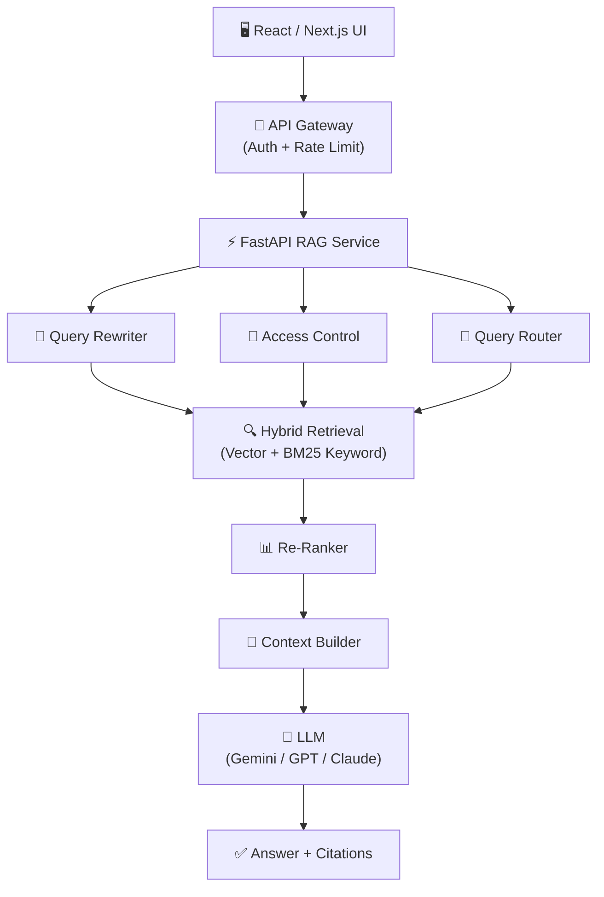
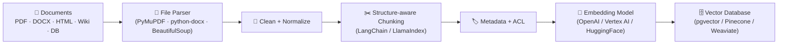
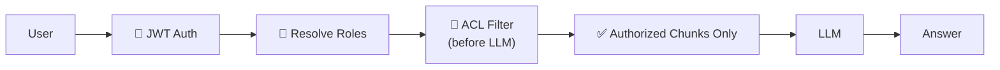
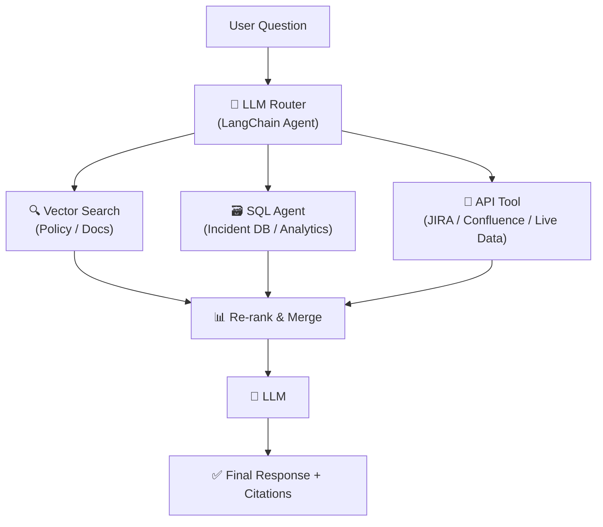

# 🧠 ERAGA — Enterprise RAG Assistant

> **E**nterprise **R**etrieval-**A**ugmented **G**eneration **A**ssistant  
> *A production-grade, security-aware knowledge assistant for enterprise teams — built with Python.*

---

## 📌 What is Eraga?

**Eraga** is not a "chat with PDF" demo — it is a **production-oriented RAG platform** built for enterprises. It combines LLMs with intelligent, permission-aware document retrieval to deliver accurate, grounded, and auditable answers from your organization's private knowledge base.

Built entirely in **Python**, Eraga leverages the rich Python AI/ML ecosystem: LangChain, FastAPI, pgvector, and leading LLM providers.

### Use Cases

| Knowledge Source | Example Query |
|---|---|
| HR Policies | "What is the leave policy for employees with < 1 year of service?" |
| DevOps SOPs | "What is the production deployment approval process?" |
| API Docs | "How does the payment service handle partial refunds?" |
| Legal / Compliance | "What are our data retention obligations under GDPR?" |
| Product Manuals | "How do I configure SSO for the enterprise edition?" |
| Incident Reports | "How many P1 incidents were raised for the auth service last quarter?" |

### Example Interaction

```
👤 User:   What is the production deployment approval process?

🤖 Eraga:  Production deployment requires sign-off from the Release Manager
           and at least two senior engineers, as per the DevOps Deployment Policy.
           Emergency fixes may bypass standard review with VP-level approval.

           📎 Sources:
              · Deployment Policy v3.2 — Section 4.1
              · Emergency Change Management Guide — Page 7
```

> ⚠️ Every answer is **grounded in retrieved documents** and provides **citations** — making it auditable and trustworthy.

---

## 🏗️ Architecture

### Online Query Pipeline



### Offline Ingestion Pipeline



> 🔑 **Key Enterprise Distinction:** Access control is applied **at retrieval time**, not left to the LLM. Permissions are attached to indexed chunks and filtered before context reaches the model.

---

## 🔧 Tech Stack

### Backend

| Layer | Technology |
|---|---|
| Language | Python 3.11+ |
| API Framework | FastAPI |
| RAG Orchestration | LangChain / LlamaIndex |
| Task Queue | Celery + Redis |
| Message Broker | Apache Kafka |
| Authentication | FastAPI + OAuth2 / JWT (python-jose) |
| ORM | SQLAlchemy + Alembic |

### RAG Components

| Component | Technology |
|---|---|
| Document Parsing | PyMuPDF · python-docx · BeautifulSoup · Unstructured.io |
| Embeddings | OpenAI `text-embedding-3` / Vertex AI / HuggingFace (`sentence-transformers`) |
| Vector DB | PostgreSQL + pgvector *(or Pinecone / Weaviate / Qdrant)* |
| Keyword Search | BM25 (rank-bm25) / Elasticsearch |
| Re-Ranking | Cohere Rerank / `cross-encoder` (HuggingFace) |
| LLM | Google Gemini / OpenAI GPT-4 / Anthropic Claude |
| Guardrails | Guardrails AI / NeMo Guardrails |

> 💡 **Start with PostgreSQL + pgvector** — it handles relational metadata and vector retrieval in one platform, reducing complexity for your first production implementation.

### Frontend & Infrastructure

| Area | Technology |
|---|---|
| Frontend | React + TypeScript / Next.js |
| Containerization | Docker + Kubernetes |
| Cloud | AWS / GCP |
| CI/CD | GitHub Actions |
| Observability | Prometheus + Grafana + OpenTelemetry |

---

## 📁 Project Structure

```
eraga/
├── README.md
├── pyproject.toml                  # Dependencies (Poetry / pip)
├── .env.example
│
├── app/
│   ├── main.py                     # FastAPI entry point
│   ├── config.py                   # Settings (pydantic-settings)
│   ├── dependencies.py             # DI: DB, LLM, vector store
│   │
│   ├── api/
│   │   ├── routes/
│   │   │   ├── chat.py             # POST /chat/query
│   │   │   ├── documents.py        # POST /documents/upload
│   │   │   ├── auth.py             # POST /auth/login, /token
│   │   │   └── feedback.py         # POST /feedback
│   │   └── middleware.py           # CORS, rate limiting, logging
│   │
│   ├── ingestion/
│   │   ├── loaders.py              # PDF, DOCX, HTML, DB loaders
│   │   ├── chunker.py              # Structure-aware chunking
│   │   ├── cleaner.py              # Text normalization
│   │   └── pipeline.py            # Ingestion orchestrator
│   │
│   ├── retrieval/
│   │   ├── embeddings.py           # Embedding model wrapper
│   │   ├── vector_store.py         # pgvector / Pinecone client
│   │   ├── keyword_search.py       # BM25 / Elasticsearch
│   │   ├── hybrid_retriever.py     # Combine vector + keyword
│   │   └── reranker.py             # Cohere / cross-encoder
│   │
│   ├── rag/
│   │   ├── query_rewriter.py       # LLM-based query expansion
│   │   ├── context_builder.py      # Chunk → prompt context
│   │   ├── prompt_templates.py     # System / user prompts
│   │   ├── llm_client.py           # Gemini / OpenAI wrapper
│   │   └── pipeline.py             # End-to-end RAG orchestrator
│   │
│   ├── security/
│   │   ├── auth.py                 # JWT & OAuth2
│   │   ├── rbac.py                 # Role-based access control
│   │   └── acl_filter.py          # Chunk-level ACL enforcement
│   │
│   ├── models/
│   │   ├── user.py                 # SQLAlchemy models
│   │   ├── document.py
│   │   ├── chunk.py
│   │   ├── conversation.py
│   │   └── audit.py
│   │
│   └── evaluation/
│       ├── dataset.py              # Golden Q&A dataset loader
│       ├── metrics.py              # Precision, recall, faithfulness
│       └── runner.py              # Automated eval pipeline
│
├── workers/
│   └── ingestion_worker.py         # Celery async ingestion tasks
│
├── tests/
│   ├── test_retrieval.py
│   ├── test_rag_pipeline.py
│   └── test_api.py
│
└── infra/
    ├── docker-compose.yml
    ├── Dockerfile
    └── k8s/
        ├── deployment.yaml
        └── service.yaml
```

---

## ⚙️ Core RAG Pipeline

> **Example Query:** *"What is our leave policy for employees with less than one year of service?"*

### Step 1 — Query Rewriting

```python
# query_rewriter.py
async def rewrite_query(query: str, llm: LLMClient) -> str:
    prompt = f"""
    Rewrite the following query to be more retrieval-friendly.
    Expand acronyms, add synonyms, and extract key concepts.

    Query: {query}
    Rewritten:"""
    return await llm.complete(prompt)
```

### Step 2 — Hybrid Retrieval

```python
# hybrid_retriever.py
async def hybrid_retrieve(query: str, user_roles: list[str], top_k: int = 20):
    vector_results = await vector_store.similarity_search(query, top_k=top_k)
    keyword_results = await bm25_search(query, top_k=top_k)

    # Merge using Reciprocal Rank Fusion (RRF)
    merged = reciprocal_rank_fusion([vector_results, keyword_results])

    # ✅ Apply ACL filter BEFORE returning to LLM
    authorized = [c for c in merged if acl_filter.is_authorized(c, user_roles)]
    return authorized[:top_k]
```

### Step 3 — Re-Ranking

```python
# reranker.py
async def rerank(query: str, chunks: list[Chunk], top_n: int = 5) -> list[Chunk]:
    results = cohere_client.rerank(
        query=query,
        documents=[c.content for c in chunks],
        top_n=top_n,
        model="rerank-english-v3.0"
    )
    return [chunks[r.index] for r in results.results]
```

### Step 4 — Prompt Construction

```python
# prompt_templates.py
SYSTEM_PROMPT = """
You are an enterprise knowledge assistant.

Rules:
1. Answer ONLY from the supplied context.
2. Do NOT invent or extrapolate information.
3. Always cite the source document, section, and page number.
4. If context is insufficient, say: "I don't have enough information to answer this."
"""

def build_prompt(query: str, chunks: list[Chunk]) -> str:
    context = "\n\n".join([
        f"[Source: {c.document_title}, Section {c.section}, Page {c.page}]\n{c.content}"
        for c in chunks
    ])
    return f"{SYSTEM_PROMPT}\n\nCONTEXT:\n{context}\n\nQUESTION:\n{query}"
```

### Step 5 — LLM Response + Citations

```
Answer:
  Employees with less than one year of service are eligible for
  X days of annual leave, as per the Employee Leave Policy.

📎 Sources:
  · Employee Leave Policy v4.1 — Section 3.2, Page 5
  · Leave Entitlement Table — Page 8
```

---

## 🏢 Enterprise Features

### 🔐 A. Document-Level Access Control



Metadata per chunk:

```json
{
  "chunk_id": "CHK-8821",
  "document_id": "DOC-1023",
  "title": "HR Leave Policy v4.1",
  "department": "HR",
  "classification": "CONFIDENTIAL",
  "allowed_roles": ["HR", "ADMIN"],
  "section": "3.2",
  "page_number": 5
}
```

> ⚠️ **Never** retrieve everything and rely on the LLM to filter. Apply access control **at the retrieval layer**.

---

### 📎 B. Citations & Traceability

Every response includes a structured citation chain:

```python
class Citation(BaseModel):
    document_title: str
    document_id: str
    section: str
    page_number: int
    chunk_id: str

class RAGResponse(BaseModel):
    answer: str
    citations: list[Citation]
    confidence: float
    latency_ms: int
```

---

### 💬 C. Conversation Memory

```python
# Selective context: summarize old turns, keep recent verbatim
async def build_conversation_context(
    session_id: str,
    new_query: str,
    max_history: int = 5
) -> str:
    history = await get_recent_messages(session_id, limit=max_history)
    summary = await summarize_if_long(history)
    return f"{summary}\n\nUser: {new_query}"
```

---

### 👍 D. User Feedback Loop

```
Answer  →  [👍 Helpful]  [👎 Not Helpful]  →  Feedback DB
                                            →  Evaluation Dataset
                                            →  RAG Quality Improvements
```

---

## 🗄️ Database Design (PostgreSQL + pgvector)

```sql
-- RBAC
CREATE TABLE users (id UUID PRIMARY KEY, name TEXT, email TEXT, department TEXT);
CREATE TABLE roles (id UUID PRIMARY KEY, name TEXT);
CREATE TABLE user_roles (user_id UUID REFERENCES users, role_id UUID REFERENCES roles);

-- Documents
CREATE TABLE documents (
    id UUID PRIMARY KEY, name TEXT, type TEXT,
    department TEXT, classification TEXT,
    version TEXT, created_at TIMESTAMP
);

-- Core RAG table with pgvector
CREATE EXTENSION IF NOT EXISTS vector;

CREATE TABLE document_chunks (
    id          UUID PRIMARY KEY,
    document_id UUID REFERENCES documents,
    chunk_index INT,
    content     TEXT,
    embedding   vector(1536),          -- OpenAI ada-002 / text-embedding-3
    page_number INT,
    section     TEXT,
    metadata    JSONB,
    allowed_roles TEXT[]               -- ACL enforcement
);

CREATE INDEX ON document_chunks USING ivfflat (embedding vector_cosine_ops);

-- Conversations
CREATE TABLE conversations (id UUID PRIMARY KEY, user_id UUID, title TEXT, created_at TIMESTAMP);
CREATE TABLE messages (
    id UUID PRIMARY KEY, conversation_id UUID,
    role TEXT, content TEXT,
    sources JSONB, created_at TIMESTAMP
);

-- Quality & Audit
CREATE TABLE feedback (id UUID, message_id UUID, rating INT, comment TEXT, created_at TIMESTAMP);
CREATE TABLE audit_logs (
    id UUID PRIMARY KEY, user_id UUID,
    query TEXT, chunks_retrieved INT,
    retrieval_ms INT, llm_ms INT,
    total_ms INT, input_tokens INT,
    output_tokens INT, cost_usd FLOAT,
    created_at TIMESTAMP
);
```

---

## 🔒 Security Architecture

### ✅ Correct: Permission-Aware Retrieval

```python
# acl_filter.py — applied BEFORE chunks reach the LLM
def is_authorized(chunk: Chunk, user_roles: list[str]) -> bool:
    return bool(set(chunk.allowed_roles) & set(user_roles))
```

### ❌ Wrong: LLM-Delegated Filtering

```python
# DO NOT DO THIS
prompt = "Here are all documents. Don't reveal HR data to non-HR users."
# The LLM is not a reliable access control mechanism.
```

---

## 📊 Evaluation

```python
# evaluation/metrics.py
from ragas import evaluate
from ragas.metrics import (
    faithfulness,
    answer_relevancy,
    context_precision,
    context_recall,
)

result = evaluate(
    dataset=golden_dataset,
    metrics=[faithfulness, answer_relevancy, context_precision, context_recall]
)
print(result.to_pandas())
```

### Metrics to Track

| Metric | Description |
|---|---|
| **Context Precision** | Are retrieved chunks relevant? |
| **Context Recall** | Are all relevant chunks retrieved? |
| **Answer Faithfulness** | Is the answer grounded in context? |
| **Answer Relevance** | Does the answer address the question? |
| **Citation Accuracy** | Are source references correct? |
| **Latency P50 / P95** | End-to-end response time |
| **Token Usage & Cost** | Per-query resource consumption |

> ⚡ Use **[RAGAS](https://docs.ragas.io/)** for automated RAG evaluation. Run evaluations on every pipeline change.

---

## 📡 Observability

### Per-Request Tracing (OpenTelemetry)

```python
# middleware.py
@app.middleware("http")
async def trace_requests(request: Request, call_next):
    with tracer.start_as_current_span("rag_request") as span:
        span.set_attribute("user.id", get_user_id(request))
        span.set_attribute("query.length", len(await request.body()))
        response = await call_next(request)
        span.set_attribute("response.status", response.status_code)
    return response
```

### Dashboard KPIs

| Metric | Target |
|---|---|
| Requests / day | Trending |
| Avg latency | < 3s |
| P95 latency | < 6s |
| Retrieval success | > 90% |
| Citation accuracy | > 95% |
| Helpful responses | > 85% |
| Cost / 1K queries | Monitored |

---

## 🤖 Advanced: Agentic RAG



```python
# Agentic RAG with LangChain tools
from langchain.agents import create_openai_functions_agent

tools = [
    VectorSearchTool(retriever=eraga_retriever),
    SQLDatabaseTool(db=incident_db),
    JiraSearchTool(jira_client=jira),
]

agent = create_openai_functions_agent(llm=llm, tools=tools, prompt=agent_prompt)
```

---

## 🗺️ Project Roadmap

### Phase 1 — RAG Foundation *(Week 1)*
- [ ] Project setup (FastAPI + PostgreSQL + pgvector + Poetry)
- [ ] PDF / DOCX / TXT document loaders
- [ ] Structure-aware chunking (LangChain / LlamaIndex)
- [ ] Embedding generation (OpenAI / HuggingFace)
- [ ] Basic vector similarity search

### Phase 2 — RAG API *(Week 2)*
- [ ] Query REST API (FastAPI)
- [ ] Hybrid retrieval (vector + BM25)
- [ ] Prompt construction & LLM integration
- [ ] Citation extraction & structured response
- [ ] Streaming response support

### Phase 3 — Enterprise Features *(Week 3)*
- [ ] JWT authentication (python-jose)
- [ ] RBAC & chunk-level ACL filtering
- [ ] Conversation history & session management
- [ ] Audit logging to PostgreSQL
- [ ] User feedback endpoint

### Phase 4 — Retrieval Quality *(Week 4)*
- [ ] Query rewriting with LLM
- [ ] Re-ranking (Cohere / cross-encoder)
- [ ] Metadata filtering
- [ ] Context window optimization
- [ ] RAGAS evaluation pipeline

### Phase 5 — Production Engineering *(Week 5)*
- [ ] Redis caching (embeddings + responses)
- [ ] Celery async ingestion workers
- [ ] Docker + Kubernetes deployment
- [ ] Prometheus + Grafana dashboards
- [ ] OpenTelemetry distributed tracing

### Phase 6 — Advanced GenAI *(Week 6)*
- [ ] Agentic RAG (LangChain agents + tools)
- [ ] SQL agent integration
- [ ] Guardrails (Guardrails AI / NeMo)
- [ ] Cost tracking & optimization
- [ ] Multi-tenant support

---

## 💼 Resume Description

> **Enterprise RAG Assistant (Eraga)**
> Designed and developed an enterprise-grade Retrieval-Augmented Generation platform using **Python, FastAPI, LangChain, PostgreSQL/pgvector** and LLMs to provide permission-aware, citation-backed answers over enterprise documents. Implemented document ingestion pipelines (PDF/DOCX/HTML), structure-aware chunking, hybrid retrieval (dense + BM25), re-ranking, RBAC with chunk-level ACL enforcement, conversation memory, RAGAS-based automated evaluation, audit logging, and full observability via OpenTelemetry. Containerized using Docker and deployed on Kubernetes with CI/CD via GitHub Actions.

---

## 🔭 Final Architecture

```
                        ERAGA — Enterprise RAG Assistant (Python)

Python 3.11 + FastAPI + LangChain / LlamaIndex
         │
         ├──── PostgreSQL + pgvector    (metadata + vector store)
         ├──── Redis                   (cache: embeddings + responses)
         ├──── Celery + Kafka          (async ingestion pipeline)
         ├──── LLM                     (Gemini / GPT-4 / Claude)
         ├──── React + TypeScript      (chat UI + admin panel)
         ├──── Docker + Kubernetes     (containerized deployment)
         ├──── AWS / GCP               (cloud infrastructure)
         ├──── GitHub Actions          (CI/CD)
         ├──── OpenTelemetry           (distributed tracing)
         └──── RAGAS Evaluation Suite  (automated quality gates)
```

> 🚀 **Eraga** is not a chatbot demo — it is a portfolio-grade enterprise AI platform built end-to-end in Python.

---

## 📚 References

- [How to Build an Enterprise RAG Architecture — CHM IT](https://www.chmit.tech/en/insights/how-to-build-an-enterprise-rag-architecture/)
- [Enterprise RAG Retrieval Scaling & Sizing Guide — NVIDIA](https://docs.nvidia.com/enterprise-reference-architectures/enterprise-rag-retrieval-scaling-and-sizing-guide/latest/summary.html)
- [RAGAS — RAG Evaluation Framework](https://docs.ragas.io/)
- [LangChain RAG Documentation](https://python.langchain.com/docs/use_cases/question_answering/)
- [pgvector — PostgreSQL Vector Extension](https://github.com/pgvector/pgvector)
